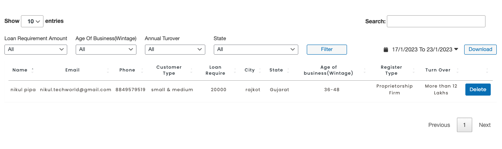
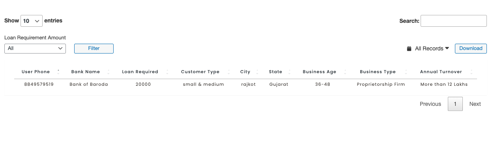
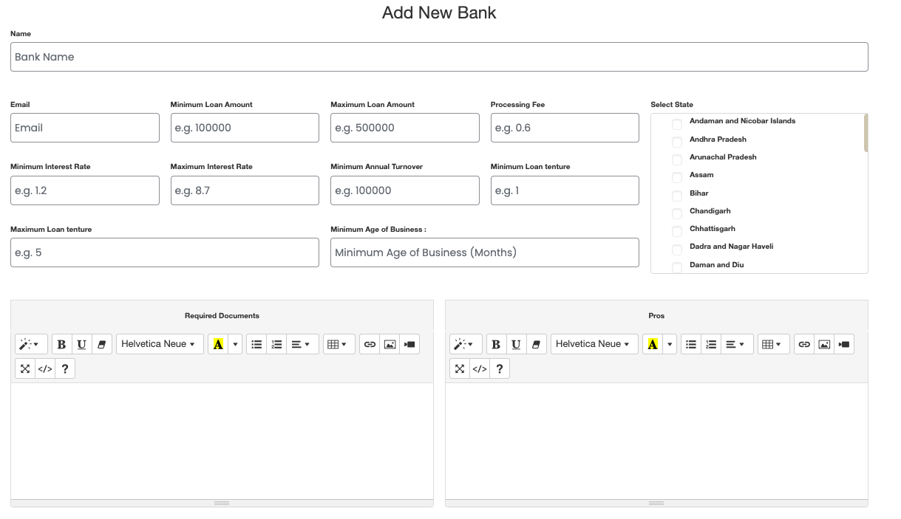
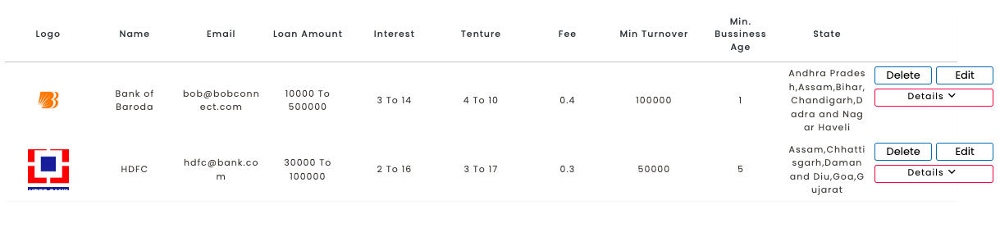
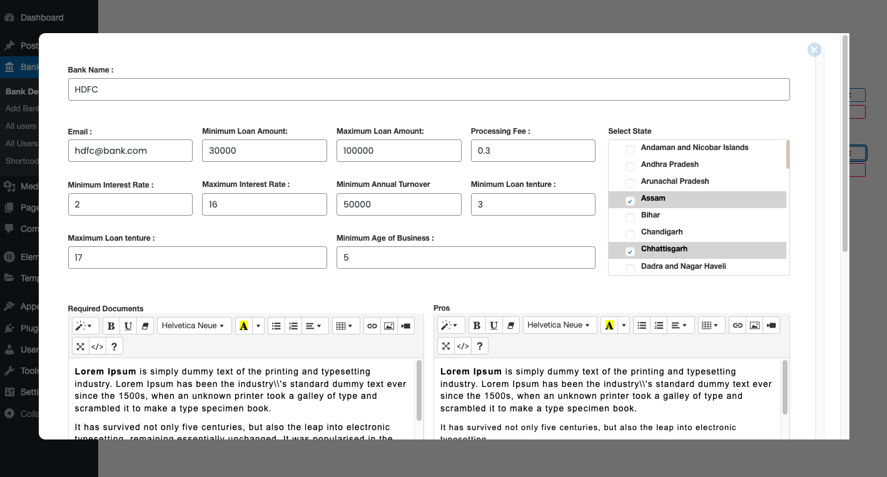
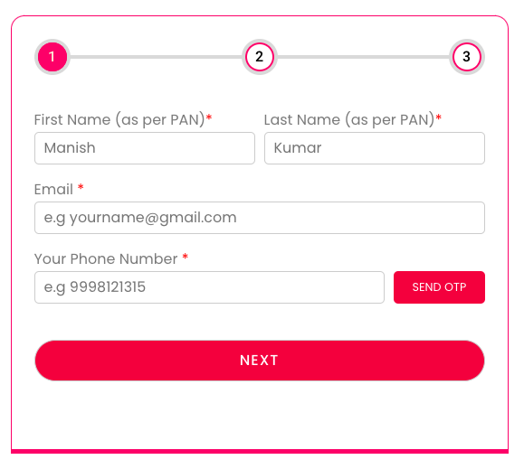
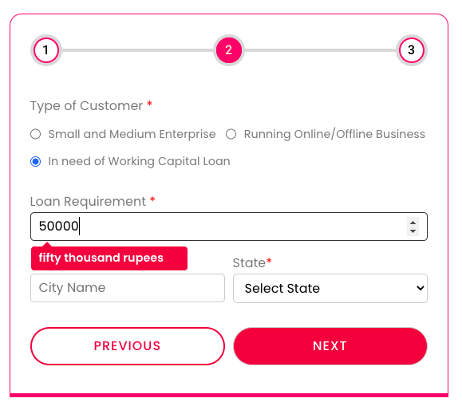
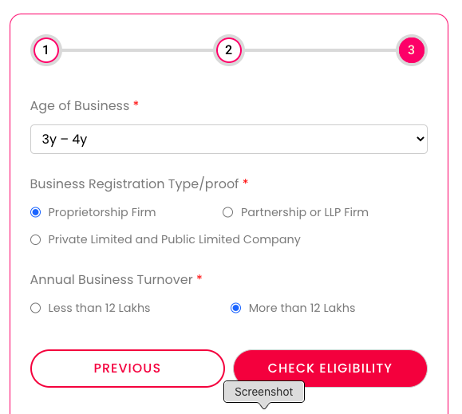
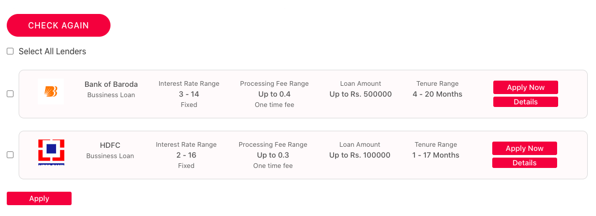

# Loan Enquiry Wordpress Plugin

* Features

* Easy to Navigate
* User can fill details by 3 step form.
    * Personal Details
    * Loan requirements
    * Bussiness Details
* User can apply to relevant bank.
* Admin can Add new bank
* Admin can view user whom applied and whom not applied successfully.
* Automated mail notification upon user apply to bank and site admin
* Download User record including applied bank in CSV format.

### Adding Commit will +1

# ScreenShots

## User Details (BackEnd)

## User Inquiry (BackEnd)

## Add New Bank (BackEnd)

## All Listed Bank (BackEnd)

## Edit Bank Details (BackEnd)

## Form Step 1 (FrontEnd)

## Form Step 2 (FrontEnd)

## Form Step 3 (FrontEnd)

## Selected Bank for User to apply (FrontEnd)

